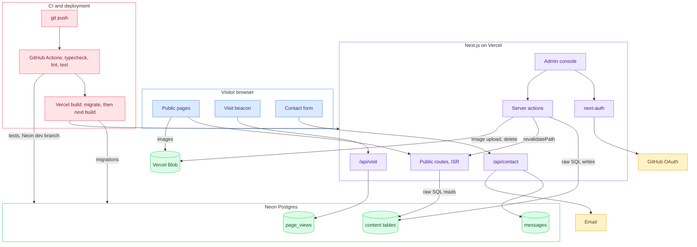
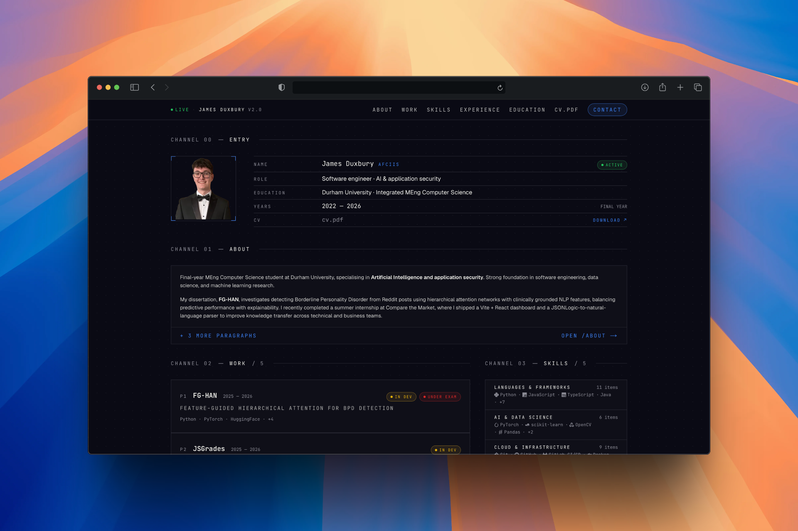
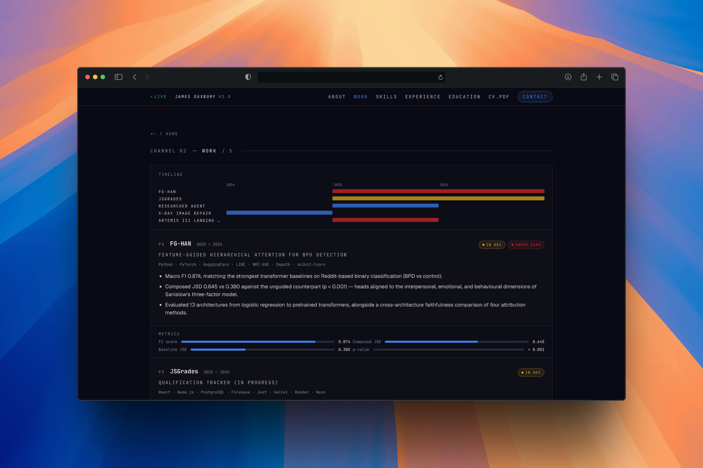
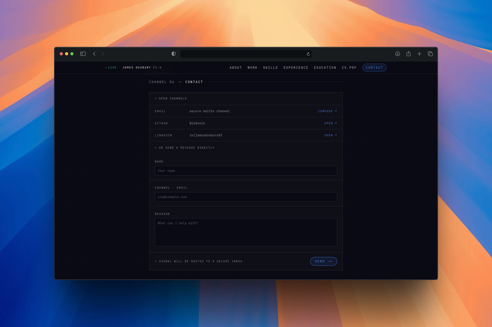
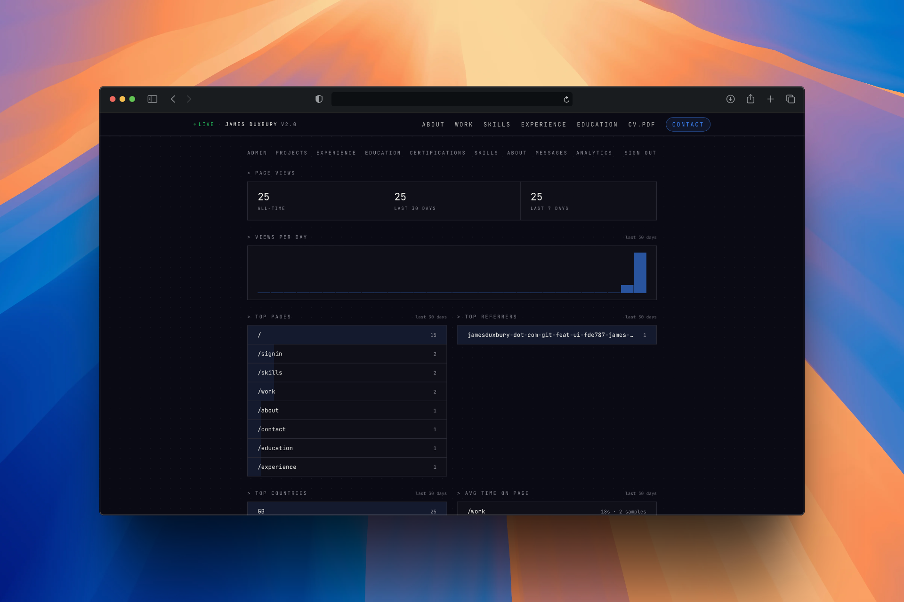

# jamesduxbury-dot-com

Source code for my personal portfolio website: [jamesduxbury-dot-com.vercel.app](https://jamesduxbury-dot-com.vercel.app)

The site started as a static portfolio and is now a full-stack application. All content is stored in Postgres and editable through an authenticated admin console, so I can update the site without a code push. Visits are tracked first-party and shown on an analytics dashboard.

## Overview

- Next.js 15 (App Router) with TypeScript and Tailwind CSS
- Neon Postgres accessed with raw SQL, no ORM
- Admin console behind GitHub OAuth, restricted to my account only
- Site images stored in Vercel Blob, uploaded and replaced from the admin console
- Public pages are statically cached (ISR) and revalidate instantly when I save an edit
- First-party, privacy-light visit analytics with an admin dashboard
- Deployed on Vercel; database migrations run on every build

## Architecture



### Content

All site content (projects, experience, education, certifications, skills, about) lives in Postgres. Public pages are server components that read through `src/db/queries.ts` and are cached with ISR (`revalidate = 60`). When I save an edit in the admin console, the server action calls `revalidatePath()` on every public route, so changes appear immediately while normal traffic stays cached. `src/data/*.ts` holds the first-boot seed data and the shared TypeScript types; after seeding, the database is the source of truth.

### Auth

Sign-in is GitHub OAuth through next-auth v5 with JWT sessions and no database adapter. Only my GitHub account can sign in: the allowlist is checked by identity at four layers: the signIn callback, the middleware on `/admin/*`, the admin layout, and every server action. Visiting `/admin` while signed out goes straight into the OAuth flow.

### Admin console

Each content section is defined once in a registry (`src/admin/sections.ts`) as field config plus a Zod schema. The list, create, edit and delete pages, the form rendering, and the SQL are all generic, so adding a section is configuration rather than new code. The console also has a messages inbox and the analytics dashboard.

### Images

Site images (the profile picture, certification badges, project images) live in Vercel Blob and are served from its CDN. The admin form kit has an upload field type: saving uploads the file, writes its URL to the row, and deletes the blob it replaced; deleting a row deletes its blobs, so the store never accumulates unused files. Each environment uploads its own copies, which keeps a replacement in one environment from breaking the other.

### Analytics

The site records page views first-party: a per-tab session id, path, referrer (first view only), country from the Vercel geo header, and time on page from an exit beacon. No cookies, no IP addresses, no fingerprinting. My own signed-in visits are excluded server-side. The dashboard shows totals, a daily chart, top pages, referrers and countries, and recent sessions.

### Contact

Contact form submissions are written to the `messages` table and emailed to me. The request only fails if both channels fail, so a mail outage does not lose messages.

## Screenshots

The public site:

<p>
  
  
</p>
<p>
  
</p>

The admin console:

<p>
  
  
</p>
<p>
  
</p>

## Design decisions

### No ORM

The schema is ten tables and the queries are straightforward. The Neon driver parameterises every tagged-template value, so the usual injection argument for an ORM does not apply, and the whole data layer stays readable in two files. Working directly with SQL was also part of the point of the project.

### A single-user allowlist instead of roles

The site has exactly one editor. Checking my GitHub login by identity at every layer is simpler and stricter than a role system, and there is no user table to manage because sessions are JWTs.

### Insert-if-missing seed

The seed exists to boot an empty database and nothing else. It inserts with `ON CONFLICT DO NOTHING`, so running it against a populated database can never overwrite content edited through the console. Tests assert this property.

### ISR with revalidation on save

Visitors get statically cached pages; the database is not touched per request. Saving in the admin console revalidates every public route, so edits appear immediately. This gets CDN speed without stale content.

### First-party analytics

I want rough visit numbers, not a tracking product. Collecting a per-tab session id and no cookies, IPs or fingerprints keeps the data in my own database and keeps the site free of consent banners.

### Images in Vercel Blob

The images are a few megabytes in total, so almost anything would work. I evaluated Cloudflare R2 and Postgres bytea behind a cached route handler; Blob won because it needs no extra account or dependency and serves straight from the CDN with no route handler in the path. Old blobs are deleted when an image is replaced, so quota stays flat.

### No chart library

The dashboard chart is a server-rendered bar chart built from divs. It is one dependency fewer and renders without client-side JavaScript.

## Database

| Table | Contents |
|---|---|
| `projects`, `experience`, `education`, `certifications`, `skill_groups`, `about_paragraphs` | Site content, one table per section, ordered by an integer `sort_order` |
| `case_studies` | One optional case study per project, keyed by project slug |
| `site_settings` | Single row of site-wide settings (currently the profile picture) |
| `messages` | Contact form submissions |
| `page_views` | Analytics events |

`experience.year_end` being NULL means a role is current.

Migrations live in `src/db/migrations/` and are applied by `src/db/migrate.ts`, which records applied files in a `_migrations` table. The build command runs the migrator before `next build`, so every deployment migrates its target database first. `src/db/schema.sql` is a snapshot of the full schema for reference and fresh setups.

Seeding (`npm run db:seed`) loads the first-boot content from `src/data/*.ts` and is safe to re-run; see the seed design decision above.

## Local setup

You need Node, npm, and a [Neon](https://neon.tech) Postgres project. I use one project with two branches: `main` for production and `dev` for local work and CI, which gives two connection strings. The app itself only ever reads one variable, `DATABASE_URL`.

Auth needs two GitHub OAuth apps, because each app allows a single callback URL: one for the production domain and one for `http://localhost:3000` (callback path `/api/auth/callback/github`). The local app's client id and secret go in `.env.local`; the production app's live in Vercel.

```bash
git clone https://github.com/jsduxie/jamesduxbury-dot-com
cd jamesduxbury-dot-com/jamesduxbury
npm install
```

Create `jamesduxbury/.env.local`:

```bash
DATABASE_URL=postgres://...        # Neon dev branch
GITHUB_ID=...                      # localhost OAuth app
GITHUB_SECRET=...
AUTH_SECRET=...                    # npx auth secret, or openssl rand -base64 32
BLOB_READ_WRITE_TOKEN=...          # Vercel Blob store with public access
```

Then set up the database and run:

```bash
npm run db:push   # apply schema.sql to an empty database
npm run db:seed   # load first-boot content
npm run dev
```

### Scripts

| Script | What it does |
|---|---|
| `npm run dev` | Development server |
| `npm run build` | Runs pending migrations, then `next build` |
| `npm test` | Full test suite with coverage thresholds |
| `npm run typecheck` | TypeScript check |
| `npm run lint` | ESLint |
| `npm run format` | Prettier, writes in place |
| `npm run db:migrate` | Apply pending migrations |
| `npm run db:push` | Apply `schema.sql` to a fresh database |
| `npm run db:seed` | Insert-if-missing seed from `src/data/*.ts` |
| `npm run images:migrate` | One-off upload of static `/images` rows to Vercel Blob |

## Testing

Vitest with React Testing Library. `npm test` runs everything with coverage, and the thresholds (90% statements, 85% branches, 90% functions, 85% lines) are enforced, so the suite fails below them. There are three kinds of test: unit, DOM (jsdom), and integration tests that run against the real Neon dev branch and clean up after themselves. Test files run serially because the integration tests share that database.

## CI/CD

One workflow, `.github/workflows/ci.yaml`, with two jobs:

- `check` runs on pushes to main, pull requests, and manual dispatch: format check, lint, typecheck, the full test suite against the Neon dev branch, and a production build.
- `populate-production` is manual dispatch only. It is a one-off job that migrated and seeded the production database when the site first moved to Postgres, and it is deliberately not automatic.

Vercel deploys `main` to production. Because the build command runs the migrator first, every deployment migrates its target database before building.
